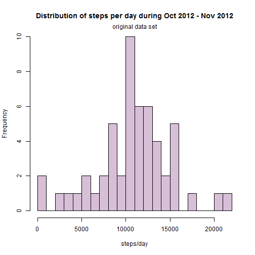
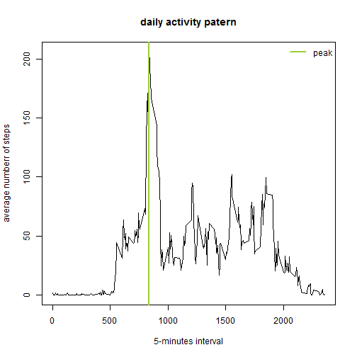
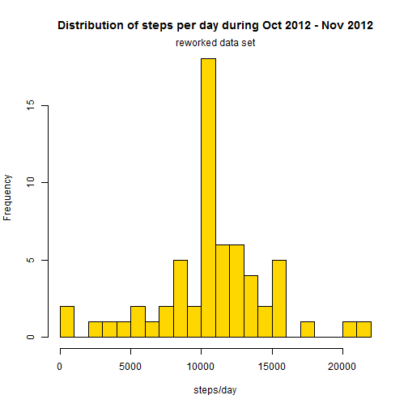
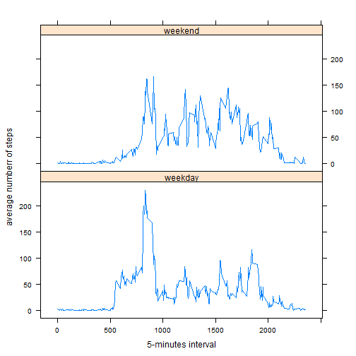

##Reproducible Research: Peer Assessment 1        
###Introduction

It is now possible to collect a large amount of data about personal movement using activity monitoring devices such as a Fitbit, Nike Fuelband, or Jawbone Up. These type of devices are part of the "quantified self" movement - a group of enthusiasts who take measurements about themselves regularly to improve their health, to find patterns in their behavior, or because they are tech geeks. But these data remain under-utilized both because the raw data are hard to obtain and there is a lack of statistical methods and software for processing and interpreting the data.


This assignment makes use of data from a personal activity monitoring device. This device collects data at 5 minute intervals through out the day. The data consists of two months of data from an anonymous individual collected during the months of October and November, 2012 and include the number of steps taken in 5 minute intervals each day.

###Data

The data for this assignment can be downloaded from the course web site:

Dataset: "http://d396qusza40orc.cloudfront.net/repdata%2Fdata%2Factivity.zip" [52K]
The variables included in this dataset are:

**steps**: Number of steps taking in a 5-minute interval (missing values are coded as NA)

**date**: The date on which the measurement was taken in YYYY-MM-DD format

**interval**: Identifier for the 5-minute interval in which measurement was taken

The dataset is stored in a *comma-separated-value (CSV)* file and there are a total of 17,568 observations in this dataset.

###Preparatory

Load the required packages:


```r
library(plyr)
library(timeDate)
library(lattice)
```


###Loading and pre-processing data

Download the data and unzip it in the working direcotory:


```r
fileUrl <- "http://d396qusza40orc.cloudfront.net/repdata%2Fdata%2Factivity.zip"
destFile <- "ActivityMonitoringData.zip"
unzippedFile <- "activity.csv"

if(!file.exists(destFile)){
        download.file(fileUrl,destfile = destFile)
}

unzip(destFile)
```

Load the data en show the structure of the dataset:


```r
activityData <- read.csv(unzippedFile,header=TRUE)
str(activityData)
```

```
## 'data.frame':	17568 obs. of  3 variables:
##  $ steps   : int  NA NA NA NA NA NA NA NA NA NA ...
##  $ date    : Factor w/ 61 levels "2012-10-01","2012-10-02",..: 1 1 1 1 1 1 1 1 1 1 ...
##  $ interval: int  0 5 10 15 20 25 30 35 40 45 ...
```

Change the class of the date variable to date


```r
activityData$date = as.Date(activityData$date,"%Y-%m-%d")
```


Disable scientific notation of numbers to increase readability of numbers


```r
options(scipen=999)
```


###What is mean total number of steps taken per day?

A new data frame is created that sums up the total steps for each date. Here we use the ddply function


```r
activityStepDay <- ddply(activityData,.(date),summarize,steps.per.day = sum(steps))
head(activityStepDay)
```

```
##         date steps.per.day
## 1 2012-10-01            NA
## 2 2012-10-02           126
## 3 2012-10-03         11352
## 4 2012-10-04         12116
## 5 2012-10-05         13294
## 6 2012-10-06         15420
```

A histogram is plotted. The number of breaks is increased in order to give a more detailed view.


```r
hist(activityStepDay$steps.per.day,breaks=20,col="thistle"
     ,main="Distribution of steps per day during Oct 2012 - Nov 2012"
     ,xlab="steps/day")
mtext("original data set")
```

 

The mean and median is calculated and reported. The NA's are removed


```r
meanSteps <- mean(activityStepDay$steps.per.day,na.rm=TRUE)
medianSteps <- median(activityStepDay$steps.per.day,na.rm=TRUE)
```

The mean number of steps each day is **10766.19**, the median number of steps each day is **10765**.


###What is the average daily activity pattern?

A new data frame is created. It contains the average daily steps over each 5-minutes interval during the day. Missing values are excluded from the calcuations.


```r
activityPatern <- ddply(activityData,.(interval),summarise,average.steps = mean(steps,na.rm = TRUE))
head(activityPatern)
```

```
##   interval average.steps
## 1        0     1.7169811
## 2        5     0.3396226
## 3       10     0.1320755
## 4       15     0.1509434
## 5       20     0.0754717
## 6       25     2.0943396
```

A time series plot is created with in x-axis the 5-minute intervals and the average number of steps taken,
averaged across all days on the y-axis. Additionally the peak is calculated and added to the graph.


```r
plot(activityPatern$interval
     ,activityPatern$average.steps
     ,type="l"
     ,xlab = "5-minutes interval"
     ,ylab = "average numberr of steps"
     ,main="daily activity patern")

peakInterval <- which(activityPatern$average.steps == max(activityPatern$average.steps))

abline(v=activityPatern$interval[peakInterval],col="olivedrab3",lwd=2)
legend("topright",lty=1,lwd=2,bty="n",col=c("olivedrab3"),legend=c("peak"))
```

 


The time interval that contains,on average, the maximum number of steps is **835** 
(steps = 206.1698113)


###Imputing missing values

Note that there are a number of days/intervals where there are missing values (coded as NA). The presence of missing days may introduce bias into some calculations or summaries of the data.

In order to solve this 2 subset are created. One that contains all the measurement where the steps value is missing and one where the measurements are complete. By counting the number of rows in the first subset we know how much values are actually missing.


```r
activityMissing <- subset(activityData,is.na(activityData$steps))
activityComplete <- subset(activityData,!is.na(activityData$steps))
nrMissing <- nrow(activityMissing)
```

The number of missing values in the dataset is **2304**


The missing values will now be replaced by the average number of steps taken during the respective interval measured by averaging across all days(see section "What is the daily activity patern?"). 

The obtained subset is binded to the subset that contains the complete data measurements. The result is a new dataset where all data is complete.


```r
activityMissing <- merge(activityMissing,activityPatern,by="interval")
activityMissing <- mutate(activityMissing,steps=average.steps)
activityMissing <- activityMissing[,-4]
activityDataNew <- rbind(activityComplete,activityMissing)
activityDataNew <- arrange(activityDataNew,date,interval)
head(activityDataNew)
```

```
##       steps       date interval
## 1 1.7169811 2012-10-01        0
## 2 0.3396226 2012-10-01        5
## 3 0.1320755 2012-10-01       10
## 4 0.1509434 2012-10-01       15
## 5 0.0754717 2012-10-01       20
## 6 2.0943396 2012-10-01       25
```

A new data frame is created that sums up the total steps for each date in the new data set. Again, we use the ddply function


```r
activityStepDayNew <- ddply(activityDataNew
                            ,.(date),summarize
                            ,steps.per.day = sum(steps))
```

A histogram is plotted. Again the number of breaks is increased


```r
hist(activityStepDayNew$steps.per.day
     ,breaks=20
     ,col="gold"
     ,main="Distribution of steps per day during Oct 2012 - Nov 2012"
     ,xlab="steps/day")
mtext("reworked data set")
```

 

The mean and median are calculated and reported.


```r
meanStepsNew <- mean(activityStepDayNew$steps.per.day)
medianStepsNew <- median(activityStepDayNew$steps.per.day)
```

The mean number of steps each day in the reworked dataset is **10766.19**, the median number of steps each day is **10766.19**.The mean number didn't change.However, the median number slightly increased by **1.19**. Mean and mediar now equal.

We also look to a couple of other estimate statistics before imputing:

```r
summary(activityStepDay$steps.per.day,digits=7)
```

```
##     Min.  1st Qu.   Median     Mean  3rd Qu.     Max.     NA's 
##    41.00  8841.00 10765.00 10766.19 13294.00 21194.00        8
```
and after imputing:

```r
summary(activityStepDayNew$steps.per.day,digits=7)
```

```
##     Min.  1st Qu.   Median     Mean  3rd Qu.     Max. 
##    41.00  9819.00 10766.19 10766.19 12811.00 21194.00
```

Although the change in the median is only marginal, the differences between the 1st quartile before and after imputing and 3rd quartile before and after imputing seems to be more significant.

###Are there differences in activity patterns between weekdays and weekends?

A new factor is created with two levels "weekday" or "weekend" indicating whether a given date is weekday or weekend. I Used the isWeekday function which is part of the package "timeDate".


```r
activityDataNew <- mutate(activityDataNew
        ,week.or.weekend = ifelse(isWeekday(activityDataNew$date)
        ,"weekday","weekend"))
activityDataNew$week.or.weekend <- as.factor(activityDataNew$week.or.weekend)
```

A new data frame is created which contains the average daily steps over each 5-minutes interval during the day, but the averages are now taken over weekdays and weekends separately.


```r
activityPaternSplit <- ddply(activityDataNew
                             ,.(interval,week.or.weekend)
                             ,summarise
                             ,average.steps = mean(steps))
```

A panel lattice plot is created. The plots are stacked in order to increase comparability


```r
xyplot(average.steps ~ interval | week.or.weekend,data = activityPaternSplit
       ,type = "l"
       ,layout = c(1,2)
       ,xlab = "5-minutes interval"
       ,ylab = "average numberr of steps")
```

 

As expected the intensity of steps in the morning is higher during weekdays compared to weekends.After the peak the activity heavily decreases during weekdays (a possible explanation is,amongst others, lower step activity of office employees during the day) and increases around the evening. During weekends intensitity of steps is more spread out across the day.
